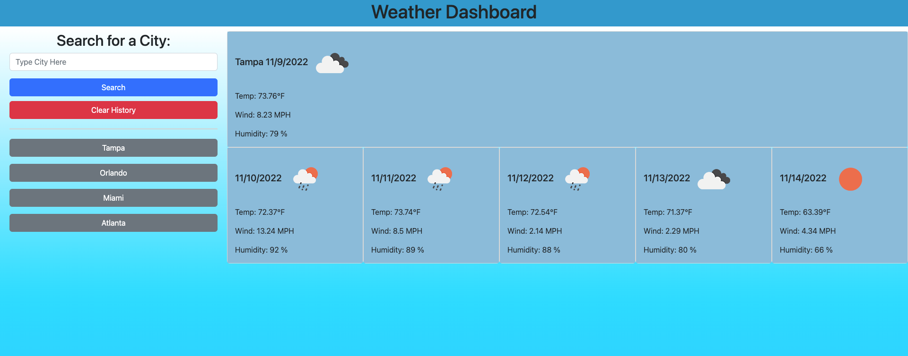

# City-Weather-Forecast-Application

## Description

I created the City Weather Forecast Application to hone in my API skills. This project allowed me to utilize all my previous logic skills and really put them to the test. I also add new features such as a Clear History button and styled the page for better user experience. I learned a lot on how to use an API to enhance my applications.

## Deployed Website

The following is are screenshots and the url of the deployed website: 

- https://albertosuarez8.github.io/City-Weather-Forecast-Application/
